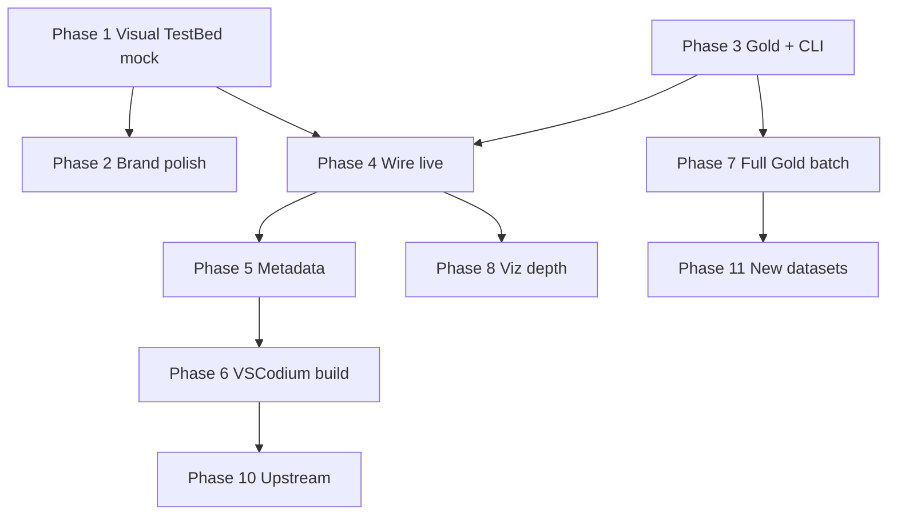
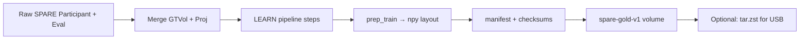

# VoxelMap TestBed — Build Plan

**Product:** VoxelMapTestBed (developer benchmark harness)  
**Distinct from:** LEARN-GUI-Python (clinician workflow)  
**Core promise:** Gold preprocessed patient packs + editable model code + reproducible benchmarks + LEARN-GUI–quality viz + experiment metadata.

---

## 1. Vision and principles

| LEARN-GUI (clinicians) | VoxelMap TestBed (developers) |
|------------------------|-------------------------------|
| Guided pipeline, trial/case selection | Fixed **Gold** packs + optional subsets |
| Fixed 4 architectures + FiLM flag | **Pluggable** architectures & modules |
| Per-run clinical context | **Experiment runs** with notes & diffs |
| PyQt desktop | **VSCodium-based IDE** (forked build + bundled TestBed extension) |
| Ad hoc runs | **Comparable** runs on same manifest |

**Design principles**

1. **Gold data is immutable** — preprocessing done once; benchmarks always reference a manifest version.
2. **Code is mutable** — developers edit models/modules in the built-in editor; runs record git hash + file snapshot.
3. **Subset or full** — same API; checklist selects patients/scans/noise types.
4. **Metadata first** — every run produces a structured record (config, notes, metrics, artifacts).
5. **Extensible datasets** — SPARE v1 is first Gold pack; new packs plug in via manifest schema v1.
6. **Reuse, don’t fork blindly** — port viz *ideas* and tensor contracts from LEARN-GUI; avoid coupling to PyQt clinical UI.
7. **Fork the packaging, not the editor source** — customize [VSCodium](https://vscodium.com/) build scripts + `product.json`; do **not** maintain a raw [microsoft/vscode](https://github.com/microsoft/vscode) fork.
8. **UI-first validation** — ship a clickable **Visual TestBed** on mock/fixture data before Gold prep; prove the editor + webviews are the right product shape, then wire real data (~3 weeks out).
9. **Local-only** — native desktop IDE on your machine; Gold on local disk (e.g. T7 bind path). No browser IDE, no code-server, no cloud, no remote deployment. *(Extension **webviews** are in-editor panels — not a web product.)*

---

## 2. System architecture (target)

**Shell decision (locked):** Fork the **[VSCodium build repo](https://github.com/VSCodium/vscodium)** — branded **VoxelMap TestBed** distribution with bundled extensions and trimmed default features. MIT-licensed, no Microsoft telemetry ([VSCodium rationale](https://vscodium.com/)).

**Deployment decision (locked):** **Local desktop only** — see §2.6. No web or container deployment paths in v1.

```
┌─────────────────────────────────────────────────────────────────────────┐
│  VoxelMap TestBed IDE (custom VSCodium build) — runs on your Mac/PC      │
│  product.json: VoxelMap TestBed · bundled extensions · trimmed UI        │
├─────────────────────────────────────────────────────────────────────────┤
│  Built-in extensions (always present)                                    │
│  ┌─────────────────────────────┐  ┌──────────────────────────────────┐  │
│  │ voxelmap-testbed (core)      │  │ voxelmap-testbed-python (opt.)   │  │
│  │ • Gold browser / checklist   │  │ • Python/debug defaults          │  │
│  │ • Experiment + notes panel   │  │ • Open VSX mirror config         │  │
│  │ • Run queue / job status     │  └──────────────────────────────────┘  │
│  │ • Results webviews           │                                       │
│  │ • Leaderboard / reports      │                                       │
│  └─────────────────────────────┘                                       │
├─────────────────────────────────────────────────────────────────────────┤
│  VS Code workbench (from VSCodium)                                       │
│  • Full editor · terminal · Git · debug · LSP                          │
│  • User workspace: models/custom/, experiments/, runs/                   │
├─────────────────────────────────────────────────────────────────────────┤
│  Python backend (local sidecar — extension spawns `vmtb serve`)           │
│  • localhost:8765  • registry  • trainer/tester  • job queue             │
├─────────────────────────────────────────────────────────────────────────┤
│  Gold Data Layer (local folder — NOT in IDE installer)                   │
│  e.g. /Volumes/T7 Shield/.../spare-gold-v1/                              │
│  ├── manifest.yaml          ← version, patients, checksums, profiles     │
│  ├── packs/{scan_id}/       ← preprocessed NumPy tensors (see §3)         │
│  └── baselines/             ← reference metrics for 4 arch + FiLM        │
└─────────────────────────────────────────────────────────────────────────┘
```

### 2.1 Why VSCodium build fork (not Electron, not raw VS Code)

| Approach | Verdict |
|----------|---------|
| **Fork VSCodium build repo** | **Selected** — full IDE, MIT binaries, community-maintained VS Code build pipeline |
| Fork microsoft/vscode source | Rejected — same editor, **much** higher merge burden |
| Electron + Monaco only | Rejected — rebuild Git, debug, LSP, terminal |
| Stock VSCodium + marketplace extension only | Fallback for dev; **not** the shipped product |

### 2.2 Fork depth (Level 3 — product distribution)

| Layer | What we customize |
|-------|-------------------|
| **VSCodium build scripts** | Clone [VSCodium/vscodium](https://github.com/VSCodium/vscodium); pin VS Code version tag |
| **`product.json`** | App name `VoxelMap TestBed`, icons, welcome URL, default extensions, extension gallery (Open VSX) |
| **Bundled extensions** | `voxelmap-testbed.vsix` built into every release (not optional install) |
| **Feature trim** | Disable/remove irrelevant built-ins via `product.json` + extension pack (see §2.4) |
| **Do NOT fork** | VS Code core TypeScript (`src/vs/...`) unless absolutely necessary |

### 2.3 Repository split

```
VoxelMapTestBed/              ← product monorepo (this repo)
├── vscodium-build/           ← fork/subtree of VSCodium scripts + our product.json overlays
├── extensions/
│   └── voxelmap-testbed/     ← TypeScript extension (views, webviews, commands)
├── backend/                  ← Python train/test/gold API (local venv)
├── gold/                     ← manifest schema (not data)
└── vscodium-build/           ← (see split above — installer only)

vscodium-build overlays:
├── product.json              ← branding + bundledExtensionIds
├── resources/icons/
├── prepare_vscode.sh         ← inject TestBed defaults
└── release/                  ← CI produces .dmg / .AppImage / .exe
```

Track upstream VSCodium on a **monthly or quarterly** rebase schedule; pin TestBed releases to `(vscodium version, testbed version)`.

### 2.4 Default feature trim (initial)

Hide or disable features irrelevant to ML benchmarking (via `product.json` / `extensionPack` / `unwantedRecommendations`):

| Remove / hide | Keep |
|---------------|------|
| Microsoft telemetry (already absent in VSCodium) | Editor, SCM, terminal |
| Copilot / AI chat (unless added later) | Python language support (Open VSX) |
| Remote SSH / WSL remote / Dev Containers | Debug adapter protocol |
| Excess welcome / tips for generic coding | File explorer, search |
| Marketplace → Microsoft | **Open VSX** gallery only |
| **Web / code-server / browser IDE** | **Out of scope (§2.8)** |

Optional later: strip unused language grammars from built-in set to shrink installer (low priority).

### 2.5 Extension ↔ backend contract

```
Extension commands:
  vmtb.gold.verify          → GET  /gold/verify
  vmtb.gold.listScans       → GET  /gold/scans?tags=...
  vmtb.experiment.run       → POST /jobs { experiment.yaml path }
  vmtb.results.open         → webview ← metrics.json
  vmtb.notes.open           → virtual doc or workspace runs/.../notes.md

Backend: **localhost:8765 only** (extension spawns local `vmtb serve`; no remote URL)
```

### 2.6 Deployment modes (local only)

| Mode | Use |
|------|-----|
| **Dev** | Stock [VSCodium](https://vscodium.com/) + F5 Extension Development Host + `fixtures/` |
| **Branded installer** | `.dmg` / `.AppImage` / `.exe` — VoxelMap TestBed on your machine |
| **Gold path** | User setting `vmtb.goldPath` → folder on T7 or local SSD (read-only OK) |
| **Backend** | Local Python venv; extension starts `vmtb serve` on demand |

**Not in scope:** code-server, browser IDE, cloud hosting, Docker Compose product, remote SSH workflow, CI GPU workers (unless you add later).

### 2.8 Out of scope (v1)

| Item | Status |
|------|--------|
| code-server / VS Code in browser | **No** |
| Web dashboard / hosted leaderboard | **No** |
| Docker / Kubernetes deployment | **No** |
| Remote development (SSH, Codespaces, etc.) | **No** |
| Multi-user / shared server | **No** |

All training, viz, and Gold access run **on the same machine** as the IDE (Mac with local or external GPU, or Linux workstation).

### 2.7 Mock mode (Visual TestBed — no Gold required)

Until the smoke Gold pack exists (~**3 weeks**), the extension runs in **`vmtb.dataMode: mock`**:

```
fixtures/                         ← committed to repo; extension reads directly
├── manifest.yaml                 # 2-scan smoke manifest (fake checksums OK)
├── baselines/smoke.json          # 8 baseline rows (4 arch × FiLM)
├── runs/
│   ├── exp_demo_baseline/
│   │   ├── experiment.yaml
│   │   ├── notes.md
│   │   ├── metrics.json          # copy shape from LEARN-GUI validation run
│   │   ├── compare/vs_baselines.json
│   │   └── test/Performance_Trace.png
│   └── exp_demo_custom/          # second run for leaderboard diff
└── train/loss_demo.csv           # TrainMonitor fixture

Extension setting:
  vmtb.dataMode: mock | live        # mock = fixtures/ ; live = backend + Gold mount
```

**Why:** You can open VSCodium, click Gold browser → checklist → experiment → results → leaderboard **this week**, and decide if the workflow feels right before investing in prep-gold.

**Swap to live:** Phase 4 flips `dataMode` to `live`; same UI, real `GET /gold/scans` and `POST /jobs`.

---

## 3. Gold data pack (the constant)

### 3.1 What “Gold” contains (per scan)

Preprocessing matches LEARN-GUI pipeline outputs **frozen** at pack build time:

```
packs/{scan_id}/
├── meta.json                 # SPARE ids, noise tag, scanner class, prep version
├── train/                    # VoxelMap train layout (128³ grid)
│   ├── SourceProjections/
│   ├── TargetProjections/
│   ├── SourceVolumes/
│   ├── DVFs/
│   ├── Masks/
│   └── Angles.csv
└── test/                     # VoxelMap test layout
    ├── (same as train) +
    ├── TestProjections/
    ├── SourceTestProjections/
    └── RespBin.csv
```

Optional **audit bundle** (read-only, for debugging, not required at train time):

```
audit/{scan_id}/
├── CT_01..10.mha             # from dicom2mha
├── sub_CT_*.mha
├── DVF_sub_*.mha
└── pipeline_log.txt
```

### 3.2 Size estimates (from LEARN-GUI runs)

| Scope | Prepared size |
|-------|----------------|
| 1 MC scan (train layout) | ~1.1 GB |
| 29 MC validation (train+test) | ~50–70 GB |
| Full SPARE Gold (MC + CV + CE) | ~100–150 GB |

### 3.3 Local delivery

Gold is a **plain folder** on disk — not baked into the IDE installer.

```
# User setting (example)
vmtb.goldPath: /Volumes/T7 Shield/DENNIS_BACKUP/gold/spare-gold-v1
```

Distribution options:

1. **Folder on T7 / local SSD** — point `vmtb.goldPath` at it (primary)
2. **Copy from `tar.zst`** — unpack once to a local path (~3 GB smoke, ~60 GB MC val)
3. **Subset packs** — `spare-gold-smoke-v1`, `spare-gold-mc-val-v1`

### 3.4 Manifest (`manifest.yaml`) — checklist source

```yaml
schema_version: 1
pack_id: spare-gold-v1
created: 2026-06-27
preprocessing:
  pipeline_version: 1.0.0
  learn_gui_commit: abc123
  grid_size: 128
  spare_password_applied: true

datasets:
  - id: spare_mc
    source: SPARE_PublicArchive
    patients_independent: true   # MC_P1 != CV_P1

scans:
  - scan_id: MC_V_P1_NS_01
    path: packs/MC_V_P1_NS_01
    split_roles: [train, benchmark]
    tags: [mc, validation, ns, p1, session_01]
  - scan_id: MC_V_P2_SC_02
    path: packs/MC_V_P2_SC_02
    split_roles: [test, benchmark]
    tags: [mc, validation, sc, p2, session_02]

profiles:
  smoke:
    description: Fast iteration (~2 scans)
    train: [MC_V_P1_NS_01]
    test: [MC_V_P2_SC_02]
  standard:
    train: [MC_T_P1_NS, MC_T_P2_SC, MC_T_P3_LD]
    test: [MC_V_P1_NS_02, MC_V_P3_LD_01, MC_V_P6_SC_02]
  full_mc_val:
    test: [ ... all 29 MC validation scan_ids ... ]

checksums:
  MC_V_P1_NS_01: sha256:...
```

The **GUI checklist** is a filtered view of `scans[]` + saved custom selections.

---

## 4. Model & module flexibility (developer surface)

### 4.1 Registry contract

```python
# voxelmap_testbed/models/registry.py
@register("concatenated_baseline")
def build_concatenated(cfg): ...

@register("my_improved_film")
def build_custom(cfg):
    from user_code.my_net import Model
    return Model(**cfg)
```

Developer edits files under:

```
workspace/
├── models/
│   ├── baselines/          # shipped, read-only
│   └── custom/             # editable in IDE
├── modules/                # FiLM variants, attention blocks, etc.
└── experiments/            # yaml/json experiment specs
```

### 4.2 Experiment spec (every run)

```yaml
experiment_id: exp_20260627_001
name: improved_film_v2
model:
  entry: models.custom.improved_film:build
  kwargs: { base_arch: dual, film_type: improved }
data:
  gold_pack: spare-gold-v1
  profile: smoke          # or custom checklist ref
  custom_scans: []        # overrides profile when set
train:
  epochs: 20
  batch_size: 8
  lr: 1.0e-5
notes: |
  Replaced FiLMLayer with ImprovedFiLM; sin/cos + learned freq.
hypothesis: Better gantry generalization on SC test scan.
```

### 4.3 Run metadata (auto-captured)

Every run writes:

```
runs/exp_20260627_001/
├── experiment.yaml          # copy of spec
├── notes.md                 # developer notes (editable before/during/after)
├── git.json                 # repo dirty/clean, commit, diff stat
├── code_snapshot/           # optional tarball of models/custom at run time
├── train/
│   ├── metrics.csv
│   └── weights_best.pth
├── test/
│   ├── metrics.json         # tester.py compatible
│   ├── Performance_Trace.png
│   └── per_scan/...
├── compare/
│   └── vs_baselines.json    # delta vs Gold baselines
└── report.md                # generated summary
```

---

## 5. Visualization (standalone, LEARN-GUI-inspired)

Port **behavior**, reimplement **UI** as **VS Code extension webviews** (React inside `voxelmap-testbed` extension).

**Phase 1 priority:** Build all P0 webviews on **fixture data** first (§2.7); refine against LEARN-GUI screenshots before Gold exists.

| LEARN-GUI source | TestBed component (extension) | Phase |
|------------------|---------------------------------|-------|
| `validation_dialog.py` | **ResultsViewer** webview — centroid LR/SI/AP, Dice, PSNR, polar gantry | **1** (P0) |
| `validation_leaderboard.py` | **Leaderboard** webview — rank vs baselines | **1** (P0) |
| `training_dashboard.py` loss curves | **TrainMonitor** webview — live loss / val loss | **1** (P0) |
| `dvf_visualisation_dialog.py` | **VolumeViewer** webview — DVF magnitude, pred vs GT warp | 8 (P1) |
| `viewer_monitors.py` (CT/DRR/DVF) | **AuditViewer** webview — Gold audit bundle | 8 (P2) |

**Tech:** Plotly.js or ECharts inside extension webviews; keep `metrics.json` schema identical to LEARN-GUI for compatibility.

---

## 6. Application modules (A–Z feature map)

| Module | Function |
|--------|----------|
| **A. App shell** | Custom VSCodium build, branding, updater |
| **B. Editor** | VS Code workbench (built-in) + Python via Open VSX |
| **C. Gold browser** | Extension TreeView: mount status, manifest, checksum verify |
| **D. Checklist** | Extension: select scans/tags; save custom lists |
| **E. Profiles** | smoke / standard / full / custom |
| **F. Experiment editor** | Webview or custom editor for YAML + form |
| **G. Notes** | Markdown notes linked to run id |
| **H. Job queue** | Extension status bar + output channel; backend GPU queue |
| **I. Model registry** | Backend discovery; extension lists baselines + custom |
| **J. Results** | Webview: metrics.json, traces |
| **K. Leaderboard** | Webview: compare runs on same profile |
| **L. Report export** | Command: MD/PDF/JSON |
| **M. Baselines** | Pre-run 8 configs on Gold; store in `baselines/` |
| **N. Local backend** | Extension spawns `vmtb serve`; venv setup doc |
| **O. Future datasets** | New manifest + `pack build` CLI |
| **P. VSCodium CI** | Rebase upstream, sign installers, ship VSIX bundled |

---

## 7. Repository layout (proposed)

```
VoxelMapTestBed/
├── BUILD_PLAN.md                 ← this file
├── README.md
├── vscodium-build/               ← fork of VSCodium build scripts
│   ├── product.json              ← VoxelMap TestBed branding + bundled extensions
│   ├── prepare_vscode.sh         ← upstream hook + our patches
│   ├── icons/
│   └── docs/UPSTREAM_REBASE.md
├── extensions/
│   └── voxelmap-testbed/         ← core VS Code extension (TypeScript)
│       ├── package.json          ← contributes views, commands, webviews
│       ├── src/
│       └── webviews/             ← ResultsViewer, Leaderboard (React)
├── backend/                      # Python (local venv)
│   ├── api/                      # FastAPI: jobs, manifests, runs
│   ├── gold/                     # manifest loader, checksums
│   ├── models/                   # registry + baselines
│   ├── train/                    # fork/adapt ml/trainer.py
│   ├── test/                     # fork/adapt ml/tester.py
│   └── prep/                     # Gold pack builder (wraps LEARN modules)
├── gold/                         # schema, example manifest (not data)
├── fixtures/                     # mock data (Phase 1)
├── experiments/                  # example experiment yaml
├── scripts/
│   ├── build-extension.sh        # vsce package → .vsix
│   └── build-ide.sh              # invoke vscodium-build → installer
└── docs/
    ├── SPARE_GOLD.md
    ├── EXPERIMENT_FORMAT.md
    ├── VSCODIUM_FORK.md          # rebase + product.json reference
    ├── ADDING_A_DATASET.md
    └── DEV_WORKFLOW.md           # Phase 1: VSCodium + F5 + mock mode
```

**Reuse from LEARN-GUI-Python (copy/adapt, not import at runtime initially):**

- `ml/dynamic_dataset.py` → `backend/train/dataset.py`
- `ml/trainer.py`, `ml/tester.py`
- `ml/utilities/networksFiLM.py`, `losses.py`, `spatialTransform.py`
- `modules/prep_train/` + pipeline steps for **Gold builder only**

---

## 8. Phased roadmap

### 8.0 Strategy — UI-first (revised)

**Pivot:** Start with the **code editor + TestBed visualization** on **mock/fixture data** (§2.7). Validate layout, workflow, and LEARN-GUI–style charts **before** Gold prep. You prepare the real dataset **~3 weeks from now**; Phases 3+ begin when smoke packs land on T7.

| Old order | New order | Rationale |
|-----------|-----------|-----------|
| Phase 0 Gold + CLI first | **Phase 1 Visual TestBed first** | See the product; confirm we're on the right path |
| Phase 2 extension after backend | Extension **now** reads `fixtures/` | No GPU, no prep-gold blocking UI |
| Phase 4 viz late | P0 webviews in **Phase 1** | Visualization *is* the early milestone |
| Phase 2b branded build | **Phase 6** (after live wire-up) | Stock VSCodium + F5 is enough for weeks 1–5 |

**Workstreams:**

| Stream | Focus | Active phases |
|--------|-------|---------------|
| **Extension** | IDE shell, webviews, mock data provider | **1**, 2, 4, 8 |
| **Gold** | prep-gold, manifest, volumes | 3, 7, 11 |
| **Backend** | trainer/tester, API, jobs | 3, 4, 5, 7, 9 |
| **VSCodium build** | product.json, CI, installers | 6, 10 |
| **DevOps** | Installers, local venv docs | 6, 10 |

**Milestone gates:**

| Gate | After | Required proof |
|------|-------|----------------|
| **G-UI** | Phase 1 | Stock VSCodium + extension: full click-through on fixtures (Gold → checklist → experiment → results → leaderboard) |
| **G0** | Phase 3 | `vmtb run` on real smoke Gold; metrics vs LEARN-GUI |
| **G-Live** | Phase 4 | Same UI with `vmtb.dataMode: live`; real train job from sidebar |
| **G1** | Phase 5 | Two real runs diff in leaderboard + `compare/vs_baselines.json` |
| **G2b** | Phase 6 | Branded local installer; smoke without manual VSIX |
| **G3** | Phase 7 | Full MC val Gold + 8 baselines |

**Dependency graph:**



**Timeline (1 FTE):**

```
Week:  1    2    3    4    5    6    7    8    9   10   11   12   13   14   15   16   17   18   19   20+
       |--------Phase 1 Visual TestBed--------|
                              |--P2--|
                                    |-----Phase 3 Gold + CLI-----|  ← dataset ready ~wk 4
                                          |---Phase 4 Wire live---|
                                                |P5|
                                                      |--Phase 6 VSCodium build--|
       (Phase 7 full Gold batch overlaps Phase 6 on local GPU)
                                                                            |--P8--|
                                                                                  P10/11→
```

### Phase summaries (quick reference)

| Phase | When | Duration | Goal | Gate |
|-------|------|----------|------|------|
| **1** | **Now** | 3 wk | Editor + all P0 webviews on fixtures | **G-UI** |
| **2** | wk 3 | 3–5 d | TestBed branding in extension (optional) | — |
| **3** | **~wk 4** | 2–3 wk | Smoke Gold + `vmtb` CLI | G0 |
| **4** | wk 5–7 | 2 wk | Extension ↔ real backend + Gold | G-Live |
| **5** | wk 7–8 | 2 wk | Experiment metadata + compare | G1 |
| **6** | wk 8–11 | 3–4 wk | Branded VSCodium installer | G2b |
| **7** | wk 11–14 | 3–4 wk | Full MC val Gold + baselines | G3 |
| **8** | wk 14–16 | 2–3 wk | VolumeViewer, AuditViewer, polish | — |
| **9** | — | — | *(removed — local-only; no Docker/web)* | — |
| **10** | ongoing | — | VSCodium upstream rebase | CVE ≤30 d |
| **11** | ongoing | — | New dataset packs | 2nd pack OK |

---

### 8.1 Phase 1 — Visual TestBed (detailed) ← START HERE

**Duration:** 3 weeks · **Prerequisites:** [VSCodium](https://vscodium.com/) installed; LEARN-GUI `metrics.json` + `Performance_Trace.png` for one run (copy into fixtures)  
**Goal:** Clickable TestBed in the editor — **no Gold, no GPU, no Python backend required**.

#### Week 1 — Editor shell + fixtures

| ID | Task | Output | Stream |
|----|------|--------|--------|
| 1.1.1 | Scaffold `extensions/voxelmap-testbed/` | `package.json`, tsconfig, webpack/esbuild | Extension |
| 1.1.2 | Activity bar + sidebar views | Gold, Experiments, Runs, Leaderboard | Extension |
| 1.1.3 | Sample workspace template | `models/custom/`, `experiments/smoke.yaml` | Extension |
| 1.1.4 | `fixtures/manifest.yaml` | 2-scan smoke (matches §3.4 shape) | Extension |
| 1.1.5 | `fixtures/runs/exp_demo_*` | metrics.json, notes, experiment.yaml from LEARN-GUI | Extension |
| 1.1.6 | `MockDataProvider` reads fixtures | `vmtb.dataMode: mock` default | Extension |
| 1.1.7 | Install VSCodium; F5 Extension Development Host | `docs/DEV_WORKFLOW.md` stub | Extension |

**Week 1 done when:** Sidebar shows mock Gold manifest + 2 demo runs.

#### Week 2 — Gold browser + experiment flow

| ID | Task | Output | Stream |
|----|------|--------|--------|
| 1.2.1 | Gold TreeView: pack id, version, “mock” badge | reads `fixtures/manifest.yaml` | Extension |
| 1.2.2 | Scan checklist + tag filter | MC_V_P1_NS_01, MC_V_P2_SC_02 | Extension |
| 1.2.3 | Profile picker: smoke / custom | updates experiment yaml preview | Extension |
| 1.2.4 | Experiment yaml editor / form webview | `experiments/smoke.yaml` | Extension |
| 1.2.5 | Notes panel | `fixtures/runs/.../notes.md` | Extension |
| 1.2.6 | “Run experiment” → **simulated** job | progress bar + copies fixture run to `runs/` | Extension |
| 1.2.7 | Welcome webview | TestBed intro + “you are in mock mode” | Extension |

**Week 2 done when:** Can select scans, edit experiment, trigger mock run, see new folder in Runs tree.

#### Week 3 — P0 webviews (the visualization milestone)

| ID | Task | Output | Stream |
|----|------|--------|--------|
| 1.3.1 | React webview build pipeline | `webviews/` + vite/webpack | Extension |
| 1.3.2 | **ResultsViewer** — centroid LR/SI/AP, Dice, PSNR | port `validation_dialog.py` | Extension |
| 1.3.3 | Polar gantry plot (Plotly.js) | interactive | Extension |
| 1.3.4 | Inline `Performance_Trace.png` | from fixture run | Extension |
| 1.3.5 | **Leaderboard** — 8 mock baselines + 2 demo runs | `fixtures/baselines/smoke.json` | Extension |
| 1.3.6 | **TrainMonitor** — replay `fixtures/train/loss_demo.csv` | simulates live tail | Extension |
| 1.3.7 | Command palette: Open Results / Leaderboard / Train | `vmtb.results.open`, etc. | Extension |
| 1.3.8 | `scripts/build-extension.sh` → `.vsix` | shareable build | DevOps |

**Gate G-UI — acceptance (do this before Phase 3):**

1. Open stock VSCodium → F5 or install VSIX.
2. Walk through: Welcome → Gold verify (mock ✓) → checklist → experiment → mock run → Results → Leaderboard → TrainMonitor.
3. Compare ResultsViewer side-by-side with LEARN-GUI screenshot (same `metrics.json`).
4. **Decision point:** Confirm layout/workflow is right; iterate UI here before Gold prep.

**Deliverables:** `extensions/voxelmap-testbed/`, `fixtures/`, VSIX, DEV_WORKFLOW.md, visual demo you can show stakeholders.

---

### 8.2 Phase 2 — Brand polish (optional, ~3 days)

**When:** End of week 3 · **Goal:** Feel like “VoxelMap TestBed” inside stock VSCodium (full fork deferred to Phase 6).

| ID | Task | Output |
|----|------|--------|
| 2.1 | TestBed icon + color theme for sidebar | `resources/` |
| 2.2 | Status bar: `TestBed · mock` / pack name | extension |
| 2.3 | Draft `product.json` fields | update `docs/VSCODIUM_FORK.md` |
| 2.4 | Record UI feedback / layout tweaks from G-UI review | issues or doc |

---

### 8.3 Phase 3 — Gold + backend foundation (detailed)

**Duration:** 2–3 weeks · **Starts:** ~week 4 when smoke dataset is ready on T7  
**Prerequisites:** G-UI signed off; SPARE smoke scans preprocessed  
**Goal:** Real smoke Gold pack + local `vmtb` CLI (extension still on mock until Phase 4).

#### Week 1 — Schema + repo scaffold

| ID | Task | Output | Stream |
|----|------|--------|--------|
| 3.1.1 | `backend/`, `gold/schema/` | monorepo dirs | Backend |
| 3.1.2 | `manifest.schema.json` | validate real manifest | Gold |
| 3.1.3 | Copy LEARN trainer/tester/dataset | `backend/train/`, `backend/test/` | Backend |
| 3.1.4 | `pyproject.toml` + `vmtb` CLI | `pip install -e .` | Backend |

#### Week 2 — Smoke Gold pack

| ID | Task | Output | Stream |
|----|------|--------|--------|
| 3.2.1 | `prep-gold` adapter | `backend/prep/build_pack.py` | Gold |
| 3.2.2 | Build 2-scan pack on T7 | `MC_V_P1_NS_01`, `MC_V_P2_SC_02` | Gold |
| 3.2.3 | Checksums + `vmtb gold verify` | real manifest | Gold |
| 3.2.4 | Update `fixtures/manifest.yaml` → match real IDs/checksums | fixture parity | Gold |

#### Week 3 — Train/test CLI

| ID | Task | Output | Stream |
|----|------|--------|--------|
| 3.3.1 | Model registry (4 arch × FiLM) | `backend/models/registry.py` | Backend |
| 3.3.2 | `vmtb train` / `vmtb test` / `vmtb run` | smoke profile | Backend |
| 3.3.3 | Metrics vs LEARN-GUI reference | `docs/METRICS_TOLERANCE.md` | Backend |

**Gate G0:**

```bash
vmtb gold verify /gold/spare-gold-smoke-v1
vmtb run -e experiments/smoke_baseline.yaml --gold /gold/spare-gold-smoke-v1
```

---

### 8.4 Phase 4 — Wire live (detailed)

**Duration:** 2 weeks · **Prerequisites:** G0, G-UI  
**Goal:** Same extension UI; flip `vmtb.dataMode: live` — real API + Gold.

| ID | Task | Output | Stream |
|----|------|--------|--------|
| 4.1 | FastAPI: `/gold/verify`, `/gold/scans`, `POST /jobs` | `backend/api/main.py` | Backend |
| 4.2 | `LiveDataProvider` implements same interface as mock | extension swap | Extension |
| 4.3 | Settings: `vmtb.goldPath`, `vmtb.backendUrl` | user config | Extension |
| 4.4 | Real “Run experiment” → GPU job | status bar poll | Extension |
| 4.5 | Results/Leaderboard read **real** `runs/` | post-train output | Extension |
| 4.6 | TrainMonitor tails real loss CSV | live job | Extension |
| 4.7 | Error UX: Gold missing, backend down | messages | Extension |

**Gate G-Live:** Run smoke benchmark from sidebar on real Gold; Results webview matches CLI `metrics.json`.

---

### 8.5 Phase 5 — Experiment metadata (detailed)

**Duration:** 2 weeks · **Prerequisites:** G-Live  
**Goal:** Documented, comparable runs (was old Phase 1).

| ID | Task | Output |
|----|------|--------|
| 5.1 | Experiment YAML schema + loader | `gold/schema/experiment.schema.json` |
| 5.2 | Run store, `notes.md`, `git.json` snapshot | `runs/` layout |
| 5.3 | `compare/vs_baselines.json` | post-run |
| 5.4 | `report.md` generator | Jinja2 |
| 5.5 | Leaderboard loads real baselines | after first baseline run |

**Gate G1:** Two real experiments diff cleanly in leaderboard.

---

### 8.6 Phase 6 — VSCodium build fork (detailed)

**Duration:** 3–4 weeks · **Prerequisites:** G-Live (G1 recommended)  
**Goal:** Shippable **VoxelMap TestBed** branded installer (was old Phase 2b).

| Week | Focus | Key outputs |
|------|-------|-------------|
| 1 | Fork `vscodium-build/`, `product.json`, icons | local `.dmg` or `.AppImage` |
| 2 | Bundle VSIX; feature trim §2.4 | preinstalled extension |
| 3 | CI matrix macOS/Linux/Windows | GitHub Actions |
| 4 | Release QA | `VoxelMapTestBed-1.0.0+vscodium1.9x` |

**Gate G2b:** Fresh install → welcome → Gold verify → smoke run (live).

---

### 8.7 Phase 7 — Full SPARE Gold (detailed)

**Duration:** 3–4 weeks (GPU compute) · **Prerequisites:** G0  
**Goal:** `spare-gold-mc-val-v1` + 8 baseline configs (unchanged from prior plan).

| Week | Focus |
|------|-------|
| 1 | Batch `prep-gold` infra, 29 scan manifest |
| 2 | Overnight batch (~50–70 GB) |
| 3 | 8 baseline runs → `gold/baselines/` |
| 4 | `docs/SPARE_GOLD.md`, leaderboard integration |

**Gate G3:** `full_mc_val` profile + 8 baselines on leaderboard.

---

### 8.8 Phase 8 — Viz depth (detailed)

**Duration:** 2–3 weeks · **Prerequisites:** G-Live  
**Goal:** Remaining viz not built in Phase 1 (P0 already done).

| Component | Source | Priority |
|-----------|--------|----------|
| ResultsViewer v2 | linked brushing, polish | P0 polish |
| VolumeViewer | `dvf_visualisation_dialog.py` | P1 |
| AuditViewer | Gold audit bundle | P2 |
| Report PDF export | `vmtb report export` | P1 |

**Gate:** Side-by-side QA vs LEARN-GUI on real run output (`docs/VIZ_QA.md`).

---

### 8.9 Phase 9 — ~~Docker~~ (removed)

**Out of scope.** Local-only product (§2.6, §2.8): backend runs via local `vmtb serve`; Gold via `vmtb.goldPath` on T7. No Docker Compose, no code-server, no web deployment.

Local backend setup is covered in **Phase 4** (wire live) + **Phase 6** (installer bundles venv instructions).

---

### 8.10 Phase 10 — Upstream maintenance (detailed)

**Duration:** Ongoing · **Cadence:** monthly security check; quarterly rebase.

Per-rebase checklist: [docs/VSCODIUM_FORK.md](docs/VSCODIUM_FORK.md) — fetch tag, rebuild VSIX + installers, smoke test.

**SLA:** Critical CVE → patched release within **30 days**.

---

### 8.11 Phase 11 — New datasets (detailed)

**Duration:** Ongoing · **Prerequisites:** G3 schema stable  

Adapter interface → `docs/ADDING_A_DATASET.md` → second pack proof (e.g. clinical subset).

**Gate:** New pack verifies; leaderboard scopes by `pack_id`.

---


## 9. Gold builder pipeline (one-time)

**When:** Phase 3 (~week 4) once SPARE smoke scans are preprocessed. Not required for Phase 1 visual prototype.



**CLI:**

```bash
vmtb gold build \
  --spare-root /data/SPARE_PublicArchive \
  --output /gold/spare-gold-v1 \
  --scans-from manifest_candidates.yaml

vmtb gold verify /gold/spare-gold-v1
vmtb gold export --output spare-gold-v1.tar.zst
```

Runs on **Linux + GPU** (DVF step); output is portable read-only volume.

---

## 10. Tech stack (recommended)

| Layer | Choice |
|-------|--------|
| **IDE shell** | **[VSCodium build fork](https://vscodium.com/)** — custom `product.json`, bundled VSIX |
| Editor / debug / Git | VS Code workbench (via VSCodium) |
| TestBed UI | TypeScript extension + React webviews |
| Python tooling | Open VSX: Python + Pylance/basedpyright (verify compatibility early) |
| Charts | Plotly.js / ECharts in webviews |
| Backend | Python 3.11, FastAPI, PyTorch |
| Jobs | In-process queue v1; Redis + RQ optional |
| Data | NumPy on disk (Gold packs); Zarr v2 optional |
| Backend runtime | **Local Python venv** on same machine as IDE |
| Config | YAML experiments + JSON Schema validation |
| CI | GitHub Actions: extension VSIX + local installer matrix (optional) |

---

## 11. Team & effort (rough)

| Phase | Duration | FTE |
|-------|----------|-----|
| **1** (Visual TestBed) | 3 weeks | 1 dev (extension + webviews) |
| 2 (brand polish) | ~3 days | same |
| 3 (Gold + CLI) | 2–3 weeks | 1 dev (backend) — **starts ~wk 4** |
| 4 (wire live) | 2 weeks | 1 dev (extension + backend) |
| 5 (metadata) | 2 weeks | 1 dev (backend) |
| 6 (VSCodium build) | 3–4 weeks | 1 dev (build + CI) |
| 7 (full Gold) | 3–4 weeks | 1 dev + local GPU time |
| 8 | 2–3 weeks | 1 dev |
| 10 | ongoing | ~0.5 day/month |

**Visual prototype (Phase 1):** ~3 weeks — clickable TestBed on fixtures.  
**MVP with real data (Phases 1–4–5):** ~8–9 weeks (Phase 3 starts when dataset ready).  
**Shippable local product (through Phase 8):** ~4–5 months part-time — **no web/Docker track**.

---

## 12. Risks and mitigations

| Risk | Mitigation |
|------|------------|
| **UI wrong before Gold built** | **Phase 1 mock mode** — iterate webviews/fixtures first (G-UI gate) |
| Mock fixtures diverge from real schema | Mirror §3.4 manifest shape; sync fixtures when Phase 3 lands |
| VSCodium upstream drift | Pin tags; automated rebase checklist; monthly release train |
| Open VSX extension gaps (Pylance) | Test Python stack early; document required extensions |
| VS Code core changes break webviews | Pin version; integration tests on rebase |
| Gold build time (29 scans) | Batch overnight on local GPU; smoke pack first |
| 200k+ small npy files | v2: Zarr; v1: local SSD / T7 folder |
| Mac without NVIDIA GPU | Train on Linux box separately, or use Apple Silicon MPS if supported; results still view locally in IDE |
| LEARN-GUI drift | Pin `learn_gui_commit` in Gold manifest |
| Custom model breaks contract | Registry validates forward() I/O shapes in CI |
| Installer signing (macOS/Windows) | Plan Apple/notarization + SignPath-style signing early |

---

## 13. Success criteria

### Phase 1 — Visual prototype (week 3)

1. Stock VSCodium + extension: full workflow on **mock data** (G-UI gate).
2. **ResultsViewer**, **Leaderboard**, **TrainMonitor** render fixture metrics; side-by-side with LEARN-GUI screenshot.
3. Gold browser + checklist + experiment editor feel right — **go/no-go** before dataset prep.

### v1 launch (all phases)

1. **Gold pack** on local path (`vmtb.goldPath`) with verified checksums.
2. **Checklist** selects any subset of manifest scans; profiles work.
3. Developer edits **`models/custom/`** in **VoxelMap TestBed IDE** and registers variant.
4. **Train + test** runs with full **metadata** (notes, git, experiment yaml).
5. **Results** match LEARN-GUI metric schema; traces render in extension webviews.
6. **Leaderboard** compares against **8 baselines** on same profile.
7. **Report** exports for documentation.
8. **Branded installer** bundles TestBed extension without manual marketplace steps.
9. Docs: install → first benchmark → custom module → rebase VSCodium fork.

---

## 14. Immediate next steps (week 1 — Phase 1.1)

See **§8.1 Phase 1** for the full breakdown. **Start with the editor, not Gold.**

1. Install [VSCodium](https://vscodium.com/) locally.
2. Scaffold `extensions/voxelmap-testbed/` — activity bar, sidebar views (Gold, Experiments, Runs, Leaderboard).
3. Create `fixtures/` — mock manifest, 2 demo runs, baselines JSON (copy `metrics.json` + trace PNG from LEARN-GUI).
4. Implement `MockDataProvider` + `vmtb.dataMode: mock` setting.
5. F5 Extension Development Host — sidebar shows mock Gold + demo runs.
6. Sample workspace: `models/custom/README.md`, `experiments/smoke.yaml`.
7. Draft `docs/DEV_WORKFLOW.md` (install VSCodium → F5 → walk fixtures).

**Defer until ~week 4 (your dataset prep):** `prep-gold`, `backend/`, `vmtb run`, manifest schema on disk.

---

*Related:* [SPARE_PublicArchive/README.md](../SPARE_PublicArchive/README.md) · LEARN-GUI-Python (clinical reference implementation)
